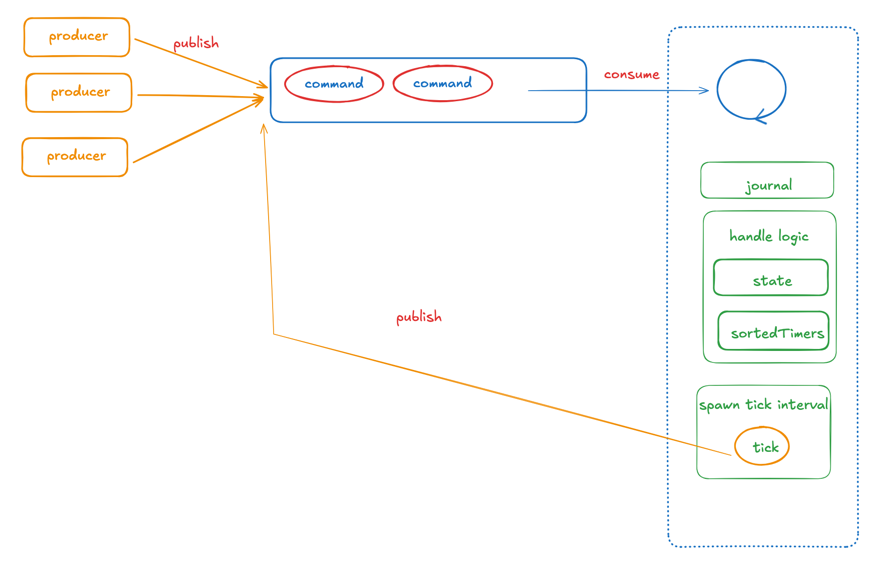
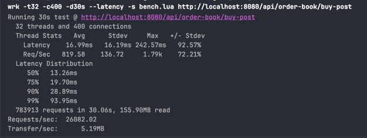

# Timeout in total ordering architecture

The approach to updating outdated data while preserving `determinism` in a total ordering architecture (such as `consensus-based systems`).

```shell
f(command[i -> j], timestampX) == f(command[i -> j], timestampY)
```



## Performance


## Stacks

- **Java 25**
- **Spring Boot 4.0.0-SNAPSHOT** - Web framework
- **RocksDB 9.4.0** - Embedded key-value database
- **JCTools 4.0.5** - High-performance concurrent data structures
- **Agrona 2.3.0** - High-performance data structures and utilities

## Development
```shell
./gradlew bootRun -Dspring-boot.run.jvmArguments="--enable-native-access=ALL-UNNAMED"
```

### Swagger

```shell
http://localhost:8080/swagger
```
